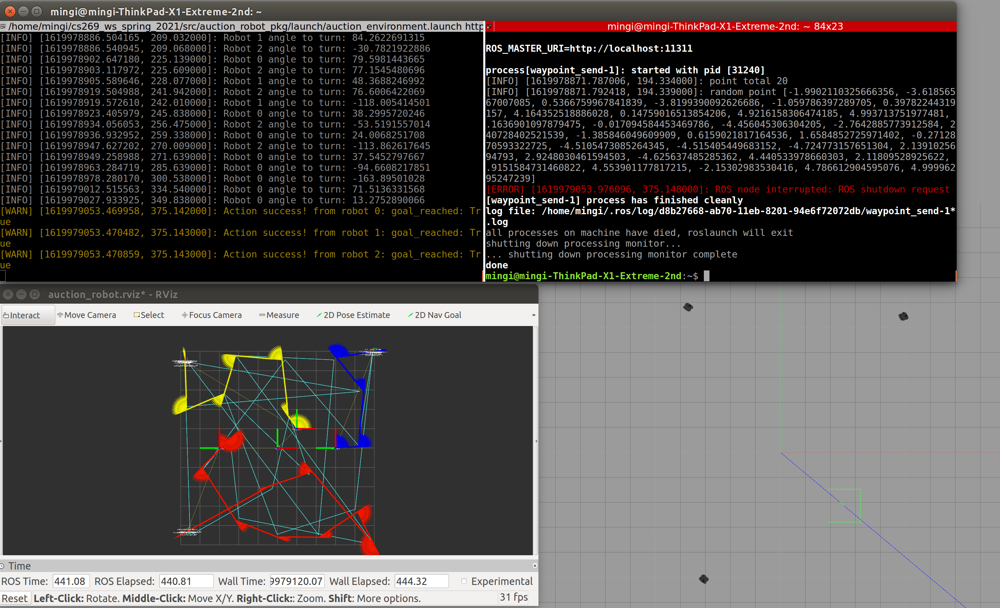
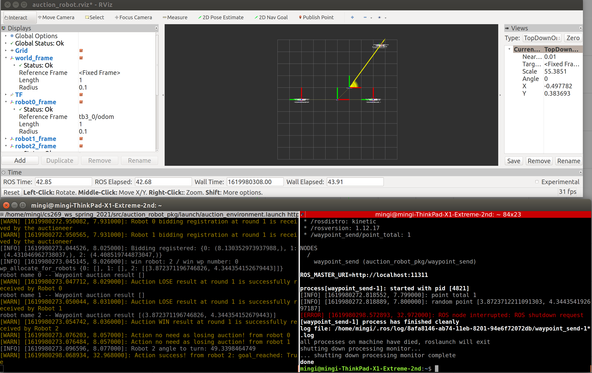
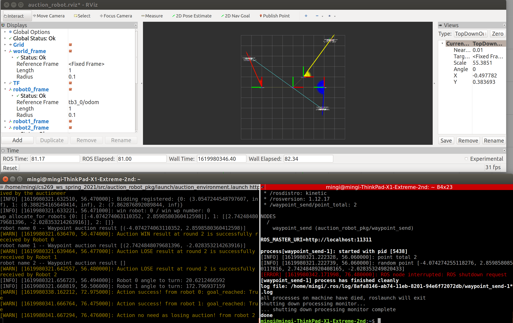
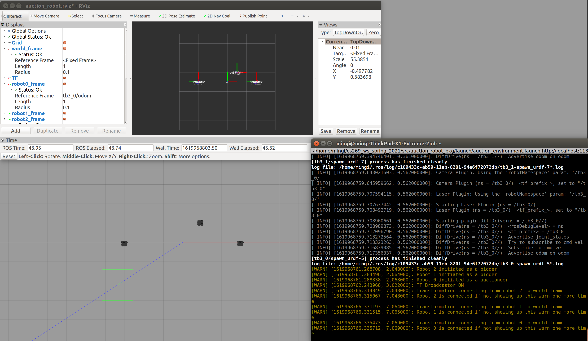
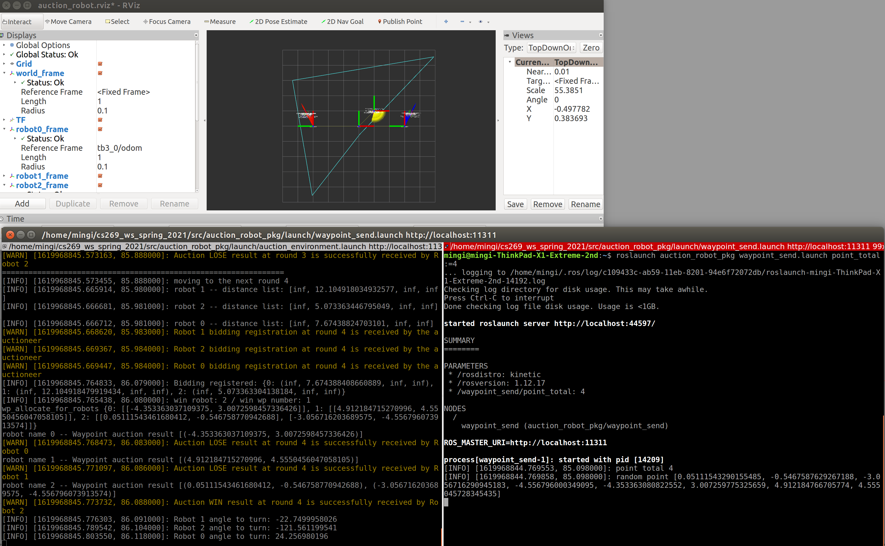
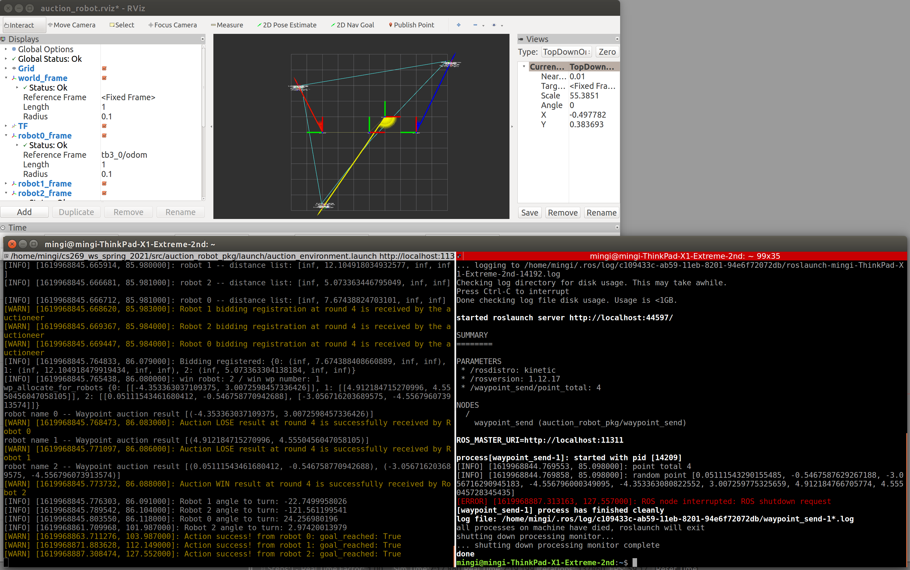
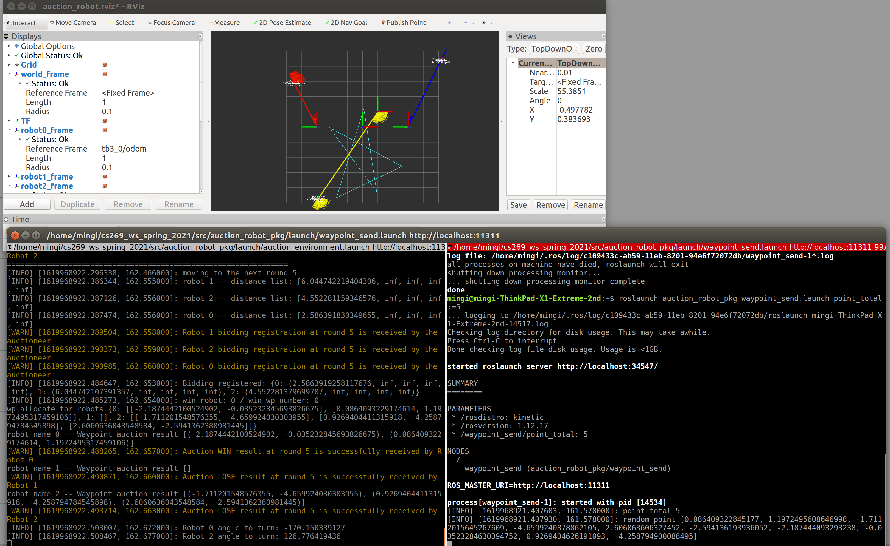
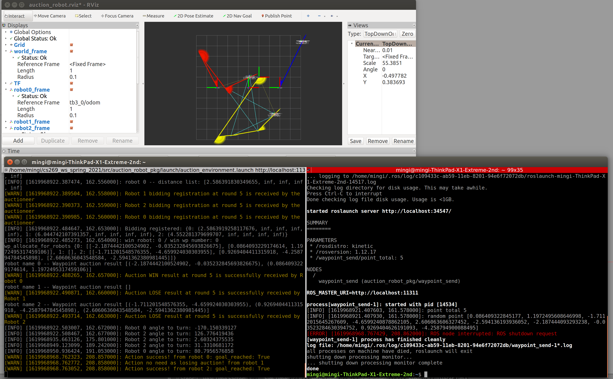

# Auction Robot ROS package
### CS269 Multi Robot Systems / 2021 Spring / PA-4
### Mingi Jeong / mingi.jeong.gr@dartmouth.edu

## 1. General
* This package achieves auctions by an auctioneer robot and goal tasks(waypoint positions) by three robots -- including the auctioneer -- as bidders. 
* There are two launch files: one launch file (`roslaunch auction_robot_pkg auction_environment.launch`) can run all the environments and TF connection nodes, while the other launch file (`roslaunch auction_robot_pkg waypoint_send.launch point_total:=NUMBER`) has a role of publishing randomly generated waypoints.
* It is robust to achieve diverse waypoints (positions and the number of waypoints) sent by ROS topic `/waypoints`. 
* It also pops up Rviz node automatically and users can easily monitor the task performance.
<div style="text-align:center">
</div>
<div style="text-align:center">Robustness test with total 20 points in one auction</div>
<div style="text-align:center">
</div>
<div style="text-align:center">Robustness test with total 1 point in one auction</div>
<div style="text-align:center">
</div>
<div style="text-align:center">Robustness test with total 2 points in one auction</div>

## 2. Method
1. Assumption
    * The _turtlebot3_waffle_pi_ model has been modified to use __encoder__ for odometry data. This is included in __custom_turtlebot3_description__ package.
    * The user starts robots with prior knowledge of initial positions and orientations of three robots with respect to the world frame. This is included in __coordination_environment.launch__. For example, the followings are first robot's argument for that pose. 
    * The user can modify this on the terminal while launching the nodes; however, it is advisable to modify in the launch file as there are total 3*3 = 9 arguments (except for z) to test spawn.    
    
        ```
        <arg name="first_tb3_x_pos" default="-3.0"/>
        <arg name="first_tb3_y_pos" default="0.0"/>
        <arg name="first_tb3_z_pos" default=" 0.0"/>
        <arg name="first_tb3_yaw"   default=" 1.57"/>
        ```
    * Most of the structures are very similar to __PA-3__, and I will mention some parts specifically different from __PA-3__.
    * The auctioneer robot is designated as `/tb3_0` as the lowest index number and all the robots including `0` are bidder robots who participated in a bid at each round.
    * For an each auction round, I don't consider the communication limitation like reachable range, in that all the robots can communicate with the auctioneer robot.
    * In my sequential auction algorithm, at each round, bidders participated in the auction with cost value calculated by the expected position following the former round.
        * In other words, at the first round, a bidder gives costs for all the intended tasks from the initial position.
        * If that robot won the first round, the robot would give costs for all the intended tasks (assuming the robot is located at the win position) except for the win task (mapped as __infinity__). 
    * After all rounds are completed, the auctioneer robot triggers the movements of the whole team.

2. Start
    * Based on the above initial position arguments, (1) they are used for spawning robots in Gazebo for those poses, (2) they are passed to __auctioneer_robot__ node (`robot_load.launch`) to make connection of TF hierarchy. 
    * This is aligned with an real environment example where an user put three robots in indoor, e. g., in Sudikoff, set the reference frame, measure their poses, and pass them as arguments to do the real tests.
    * Specifically, in __auctioneer_robot__ node, the robot saves the initial pose from Rosparam and publishes `/initialpose` topic with message type `geometry_msgs/PoseWithCovarianceStamped` after transforming Euler to quaternion. 
    * Then, __tf_broadcastor__ node receives `/initialpose` topic and broadcast TF whenever (every call back) the message is received. 
    * The connection of TF hierarchy is same as __PA-3__.
    <div style="text-align:center">
    </div>

3. Task-related
    1. Instantiation
    * An auctioneer and bidders are initiated by respective __coordination_robot__ nodes. Depending on arguments (auctioneer flag), it will instantiate a relevant class despite the same reusable node code. 
    * Another good implementation design is to use inheritances by super class (_cauction_robot_super.py_). All the common features are included in super class, while specific features from either auctioneer (_auction_robot_aiuctioneer.py_) or bidder (_auction_robot_bidder.py_) are implemented in the descendant class. 
    * _Note_: many of the common properties and functions are moved from Bidder class to Super class, since the auctioneer is a bidder, too.
    
    2. waypoint inputs
    * Note that after `auction_environment.launch`, you will see robots in Gazebo and Rviz in addition to robot load and TF connection on the terminal with ros logwarn (visualized in yellow). 
    * Then, on another terminal, if you initiate `waypoint_send.launch`, it passes randomly generated waypoints -- a position is apart -- more than 2m by constant -- from one another. Arguments as `point_total` can be selected from reasonable integers (from 1, but recommended to use from 3), but feel free to change, if you want. The _reasonable_ here means that theoretically it is not possible to generate points over 50 (assuming all points are distributed equally with interval 2 meter), because the distance threshold is 2m. 
    * The waypoints are sent via `waypoints` topic with message type `PolygonStamped`, which made it easier to visualize in Rviz. The example is that the robots starts the one auction after finishing the 4 rounds (4 task points). _Note_ that each color denotes each robot: red -- tb3_0, blue -- tb3_1, yellow -- tb3-2.
    <div style="text-align:center">
    </div>

4. Auctioneer and Bidder
    * In principle, I am using a finite state machine to check a certain state is met (e. g., a certain prior message is received so that a robot can head to the next step).
    1. Custom message for intention of auction waypoints
        * Once the auctioneer receives `waypoints` topic (save in self._wp_msg), it sends the custom message via `wp_allocate_intention` topic to bidders. 
        * The custom message (`Waypoint_init.msg`) includes (1) auctioneer robot name, (2) current auction round, (3) some string information (4) waypoints coordinated represented in a format `geometry_msgs/Polygon`, which again makes it easier to extract waypoint coordinates, and (5) waypoint allocation result array as per auctions. For example, after the first round and index 1 task position is allocated to a bidder, it denotes [False, True, False, ...].

    2. Registration Service -- Auction participation
        * Once a bidder robot receives `wp_allocate_intention` topic, the bidder (__client__) robot sends a request to the auctioneer via Service proxy designated on that specific robot. 
        * The custom service `ServiceRegistration.srv` includes (1) bidder robot name (2) cost values to each waypoint in 1D array.
        The first round cost is based on the global position transformed by TF listener implemented in Superclass (see self._look_up_transform, self.transform_local_psn_wrt_global). The following round cost is based on the winning position from the previous round as mentioned in _assumption_ section. (See the line 167-229 in Super class). 
        * The auctioneer (__server__) receives the request, registers bidder robots, then, gives a response back with Bool.
        * The bidder noticed it is registered as a member of bidding and the result is logged with rospy.logwarn for the user to see.
    
    3. Allocation Service -- Win vs. Lose result of a waypoint at each round
        * After the auctioneer robot checks the condition (line 137 in _auction_robot_auctioneer.py_), the auctioneer allocates one waypoint to a bidder (including the auctioneer) based on the minimum distance approach (see line 152-170 in auctioneer class.py).
        * The auctioneer (__client__) sends a request (result of that round) to each bidder via ServiceAuctionResult.srv.
        * Using this procedure, the bidder knows whether it won that specific round or not. This is conducted by the bidder (__server__) receiving the auctioneer's request (See the line 232-259 in Super class). 
        * The auctioneer moves to the next round, until the entire auction is completed (see line 220-242 in auctioneer class.py).
        * The bidder calculate the cost values based on the winning task position for the next round. _Note_ that the already allocated auction waypoint is quickly mapped as infinity and it does not get involved in __minimum__ calculation (See the line 207-216 in Super class).

    4. Action Goal
        * The custom action (`Coordination_Destination.action`) takes care of making robots reach waypoints. It includes (1) Goal position 2D array as a list of x,y coordinate list (2) feedback as distance to go (Euclidean distance) (3) result as boolean to indicate the action goal is completed.
        * The auctioneer has a role of __client__ connected to a respective robot (__server__) -- bidder. Note that the auctioneer itself is a __server__, too. For this reason, the server is implemented in Superclass (line 262-278).
        * Once the __server__ receives a list of the action goals, the robot (1) matches its heading towards its allocated destination (line 303 in Super class) and (2) translate to the destination (line 307 in Superclass). 
        * The bidder winning at least one auction move to the list of goal locations until it completes (line 301 in Super class). During the action, the robot gives a feedback callback in terms of the remaining distance. It is printed out as rospy.loginfo in __PA-3__, but I commented out as it is too much disturbing.
        * Finally, when the robot reached the waypoint lists, the __client__ -- auctioneer -- receives the result and the result is also logged as logwarn. 
        * _Note_ that if there is a robot which failed to win at least one auction, it does not proceed to any waypoint; thus, it gives the complete result at the beginning of the action client.

    5. Flush out
        * There were some updates of class properties during the above steps. The main purpose is to block unnecessary repetition of previous steps. However, in order to perform the new auction task (`waypoint_send`) while the main node (`auction_robot`) is running, they should be initialized.
        * Once the auctioneer found out that all the robots reached the allocated waypoints, the auctioneer publishes `flushout` topic for a certain period (5 sec in my case). Then, (1) the auctioneer itself initializes the necessary properties, (2) the bidders initializes, (3) waypoint_send node shuts down.
        * Note that I found out the server and client of 'service' and 'action' can be maintained, as they work as connection bridge. 
        * After the robots flushed out, if the user execute `waypoint_send.launch` with another `point_total` argument, the robots resume the steps above: participate in the new auction, allocated to the new waypoints, go to the destinations again.


## 3. Evaluation
Please see the additional material video.
    ```
    * Start: start of the first auction (total points: 4)
    * 49 sec: finish of the first auction
    * 54 sec: start of the second auction (total points: 5)
    * 2 min 36 sec: finish of the second auction
    * 2 min 41 sec: start of the third auction (total points: 3)
    ```

1. Task performance
    * My code performs well with being well organized and commented.
    * It is robust in achieving diverse waypoints (random locations + the different number of waypoints) with initialized positions.
    * The code fully achieves the PA-4 criteria such as extension of PA-3 such as TF broadcast, reuse of the service, action. 
    * The mainly changed parts are: 
        * Conducting sequential auction and communication at each round between the bidder and the auctioneer
        * Action goal with 2D array implemented by a custom message of 1D array, which makes winners conduct tasks after the completion of one auction.
    * You can see the visualization together with rviz running automatically. 

    <div style="text-align:center">
    </div>
    <div style="text-align:center">The first auction (4 rounds -- 4 points) finished, after the robots went to allocated points. </div>
    <div style="text-align:center"> 
    </div>
    <div style="text-align:center">The second auction (5 rounds -- 5 points) began right after the first auction. </div>
    <div style="text-align:center"> 
    </div>
    <div style="text-align:center">The second auction (5 rounds -- 5 points) finished, after the robots went to allocated points. </div>


2. Discussion
    * __Error of position__: I have observed errors as offsets from the intended destinations. There are several reasons like PA-1, PA-3, but here are the main ones:
        * Dynamic and physics model of the robot: control of the robot is not always sharp as our intention due to friction, inertia, etc.
        * Odom based on encoder also brings about more errors. Odom is weak to drifting and odom data themselves include noise. Therefore, even when the robot is sharply at a starting position, I was able to observe the position slightly increasing as time elapsed.
        * This indicates that, in general, the more the robots move, the more errors arise.
        * One example is shown as the following two figures. _feedback_ on the terminal is based on Euclidean distance between the current transformed position with respect to the world and the goal position with respect to the world. As a result, the method seems to accumulate errors (simulated as a wheel encoder), i.e., actual global positions with larger offsets. lease see __PA-3__ for the attached figure.
        * Another interesting error is between Gazebo and Rviz. I assume that it is caused by some physics-related error such as friction, plus odometry. Please see __PA-3__ for the attached figure.

    * __Action server connection__ : I was about to re-instantiate action server connection during the flushout process. I realized that the original action server/client is still alive and it gave some error such as adding the same action server/client is not valid. Therefore, I used a finite state machine to block unnecessary procedures during the call back of the action, even if the action goal had been completed. 